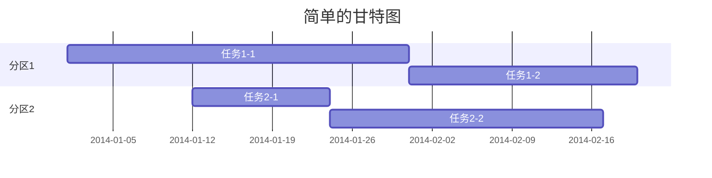
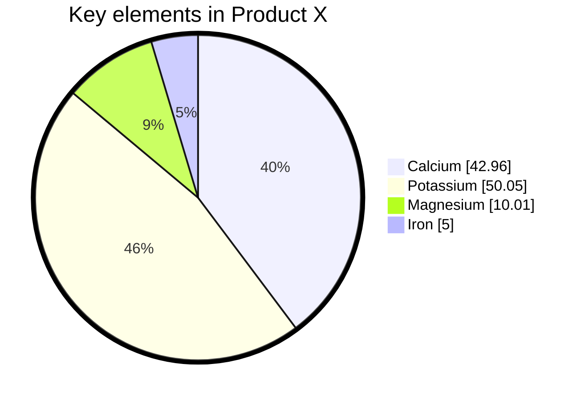
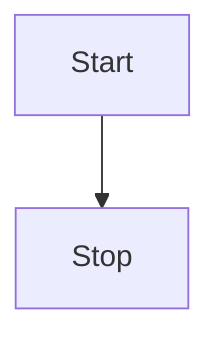
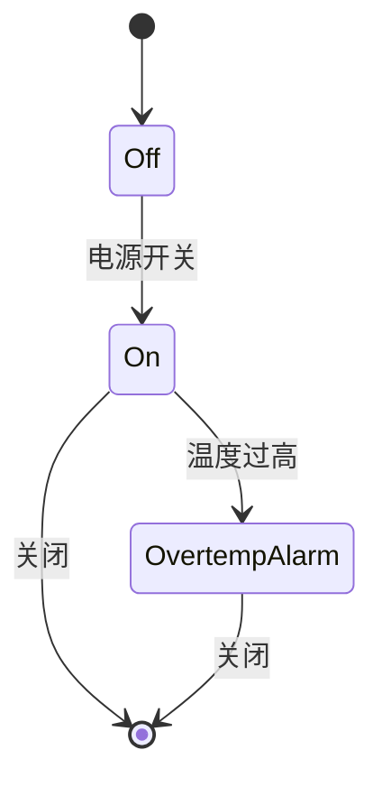

::: details
```js
export default {
  data() {
    return {
      msg: 'Focused!', // [!code  focus]
    } // 上面的 !code focus 之间的空格实际为 1 个
  },
}
```
:::


```mermaid
gantt
    title 简单的甘特图
    dateFormat  YYYY-MM-DD

    section 分区1
    任务1-1           :a1, 2014-01-01, 30d
    任务1-2           :after a1  , 20d

    section 分区2
    任务2-1      :2014-01-12  , 12d
    任务2-2      : 24d
```

```mermaid
%%{init: {"pie": {"textPosition": 0.5}, "themeVariables": {"pieOuterStrokeWidth": "5px"}} }%%
pie showData
    title Key elements in Product X
    "Calcium" : 42.96
    "Potassium" : 50.05
    "Magnesium" : 10.01
    "Iron" :  5
```

```mermaid
flowchart TD
  Start --> Stop
```

```mermaid
stateDiagram-v2
  [*] --> Off
  Off --> On : 电源开关
  On --> OvertempAlarm : 温度过高
  On --> [*] : 关闭
  OvertempAlarm --> [*] : 关闭
```
